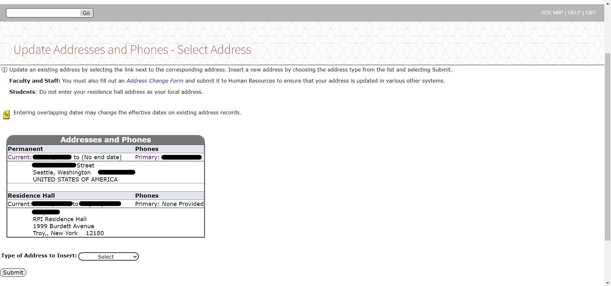

# Make RPI's SIS a Little Less Ugly.

This is a little Chrome extension that will make the Rensselaer Polytechnic Institute SIS page less of a horror to look at!

## How to Install
[**Open Chrome Webstore**](https://chrome.google.com/webstore/detail/edifoemhedcmjjmndaoaipfjnebeipdd)

_Click "Add to Chrome"_

## Supported Browsers

Google Chrome and all Chromium-based browsers should support this extension!
- Microsoft Edge
- Opera
- Amazon Silk
- Samsung Internet
- Qihoo 360 Secure Browser
- Vivaldi
- _...and countless others!_

----

## Share

**Nobody likes the ugly SIS page.** Help them out by sharing!

**Sharable Link:** https://github.com/2kai2kai2/SISfix

[^1]

----

## Gallery

----

## Security
_Please don't get mad at me, RPI admin._

- Does not include scripts or request data from any webpages.
- Only injects CSS stylesheets into SIS pages.
- Only has permissions to `https://sis.rpi.edu/*` addresses.

[^1]: If anybody actually uses twitter